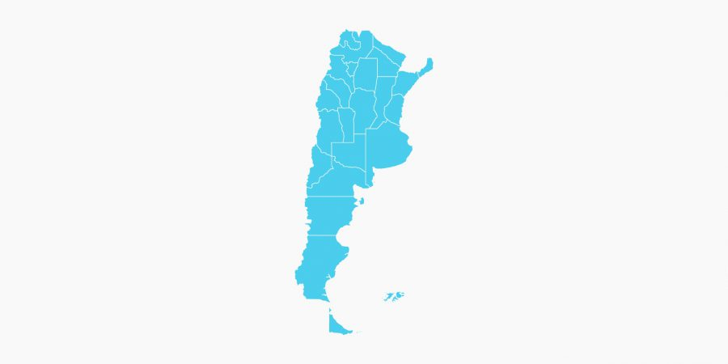

# 
Jhonevergallegoate_PI_DA-02

# 
Análisis del Sector de Telecomunicaciones en Argentina

------------------------------------------------------------------------

## DESCRIPCIÓN DEL PROYECTO:

La ejecución de este proyecto se desarrolla desde la perspectiva de un analista de datos enfocado en el análisis del sector de telecomunicaciones en Argentina. El enfoque central es analizar datos relacionados con la conectividad y el acceso a servicios de telecomunicaciones en diferentes regiones del país. El propósito principal es proporcionar información crucial que respalde la adopción de medidas destinadas a mejorar la equidad en el acceso y la calidad de los servicios de telecomunicaciones.

**Objetivos del Análisis:**
- **Equidad en la Conectividad:** Evaluar la equidad en el acceso a Internet y servicios de telecomunicaciones en distintas regiones del país, identificando disparidades y áreas de mejora.

- **Cambio Tecnológico:** Analizar patrones de cambio tecnológico en la adopción de servicios, destacando preferencias de los usuarios y la transición hacia tecnologías más avanzadas.

- **Calidad de Servicio:** Evaluar la calidad de servicio en términos de velocidad de conexión, identificando áreas con conexiones más lentas y proponiendo mejoras.

- **Oportunidades de Crecimiento:** Identificar oportunidades de crecimiento en el sector, considerando la demanda de velocidades más altas y las preferencias emergentes de los usuarios.

**Importancia del Proyecto:**

- El análisis del sector de telecomunicaciones desplegado en este proyecto es esencial para respaldar decisiones estratégicas y políticas que impulsen la equidad en el acceso a servicios de conectividad en todo el país. La colaboración con diversas entidades del sector asegura la relevancia y aplicabilidad de los resultados obtenidos.

- Este informe proporciona una visión general del proyecto, destacando su relevancia y los objetivos clave que orientan el análisis de datos en el sector de telecomunicaciones en Argentina. La combinación de la experiencia del analista de datos y la colaboración con entidades del sector permite obtener perspectivas sólidas y acciones concretas para mejorar la conectividad a nivel nacional.

## DESARROLLO DEL PROYECTO:

El proyecto se enfoca en analizar datos del acceso a Internet en Argentina, disponibles en el sitio oficial de la ENACOM: https://datosabiertos.enacom.gob.ar/dashboards/20000/acceso-a-internet/ Acceso a Internet en Argentina. El objetivo es realizar un proceso de Extracción, Transformación y Carga (ETL) para consolidar y depurar la información, seguido por un análisis exploratorio de datos (EDA) y la creación de un dashboard interactivo que proporcione una visualización dinámica y accesible de los datos analizados.

- **Fuentes de Datos:** La fuente principal es el portal oficial de la ENACOM, asegurando autenticidad y actualidad. La variedad de datos permite un análisis exhaustivo del acceso a Internet en el país.

- **Proceso ETL:** Se implementa ETL para garantizar integridad y coherencia de datos. Durante esta fase, se consolida la información dispersa y se depuran posibles inconsistencias.

- **Análisis Exploratorio de Datos:** Busca discernir tendencias y patrones significativos en el acceso a Internet en Argentina. Se utilizan herramientas estadísticas y visuales para comprender la evolución temporal, disparidades geográficas y preferencias tecnológicas.

- **Análisis de los KPIs propuestos:** Los KPIs (Key Performance Indicator) son métricas específicas y cuantificables utilizadas para medir el rendimiento de una organización, un proceso o una actividad en relación con sus objetivos estratégicos. Estos indicadores son esenciales para evaluar el éxito o el progreso hacia metas establecidas y permiten a las empresas tomar decisiones informadas basadas en datos concretos. En este proyecto trabajaremos con 3 KPIs:
    - KPI 1: Aumentar en un 2% el acceso al servicio de internet para el próximo trimestre, cada 100 hogares, por provincia --> Este KPI proporciona información sobre el cambio porcentual en la penetración de Internet en cada provincia durante un período determinado.
    - KPI 2: Velocidad Promedio de Conexión a Internet por Hogar --> Evalúa la calidad del servicio en términos de la velocidad experimentada por los usuarios.
    - KPI 3: Ingresos financieros obtenidos por el sector de telecomunicaciones en un trimestre --> Evalúa el rendimiento financiero del sector en periodos específicos.

- **Dashboard:** Se crea un dashboard interactivo que proporciona una visualización dinámica y accesible de los datos analizados. Además, se genera un informe del análisis que ofrece insights y conclusiones derivadas del estudio realizado.

------------------------------------------------------------------------

# 
INFORME

## Exploración General

El análisis del sector de telecomunicaciones en Argentina revela una panorámica compleja, marcada por cambios significativos en la penetración de Internet fijo y el acceso a diversas tecnologías. A lo largo del período de estudio (2014-2022), se observa un aumento generalizado en la penetración de Internet fijo por cada 100 hogares, indicando un crecimiento constante en la adopción de servicios de conectividad. Este crecimiento, sin embargo, no está distribuido uniformemente entre provincias, generando disparidades notables.

La tendencia ascendente en los accesos a Internet fijo por banda ancha y banda angosta sugiere un cambio tecnológico, con la banda ancha fija ganando terreno frente a opciones más antiguas como Dial-Up. Este cambio refleja una adaptación positiva a tecnologías más modernas y eficientes.

## Análisis Geográfico

El análisis geográfico resalta la variabilidad en la distribución de accesos a Internet entre provincias. La Capital Federal lidera en acceso a Internet por cada 100 hogares, destacándose significativamente frente a otras provincias. Estas disparidades geográficas persisten en la adopción de diferentes tipos de conexiones, subrayando la necesidad de esfuerzos focalizados para mejorar la infraestructura en regiones menos desarrolladas.

La preferencia por tecnologías específicas, como fibra óptica, ADSL, y cablemódem, exhibe patrones de cambio a lo largo del tiempo. El análisis trimestral de la velocidad media de bajada muestra notables disparidades entre provincias, lo que destaca la urgencia de esfuerzos continuos para equilibrar la calidad de la conexión en todo el país.

## Calidad de Servicio y Oportunidades de Crecimiento

La calidad del servicio, medida por la velocidad media de bajada, ha experimentado un aumento notable. Sin embargo, persisten desafíos, como la presencia de conexiones más lentas y disparidades en la velocidad entre provincias. Estas tendencias apuntan a la necesidad continua de mejorar y estandarizar el acceso a Internet en diferentes regiones.

El análisis de los ingresos trimestrales muestra un crecimiento financiero sostenido, con un punto culminante en el último trimestre de 2022. La estacionalidad en los ingresos destaca la importancia de estrategias para gestionar variaciones y mantener un crecimiento constante.

## Provincias que podrían necesitar Mejoras en Acceso a Internet

La identificación de provincias que podrían necesitar mejoras en términos de acceso a Internet y calidad de servicio depende de varios factores. Aquí hay algunas observaciones y recomendaciones específicas:

1. **Provincias con Baja Penetración de Internet:**
   - Formosa muestra el promedio más bajo, con solo 26.58 accesos por cada 100 hogares. Podría ser prioritario mejorar la infraestructura y aumentar la disponibilidad de conexiones en esta provincia.

2. **Provincias con Velocidades Bajas:**
   - Provincias como La Pampa, Chubut, Tierra del Fuego, San Juan y Santa Cruz experimentan velocidades considerablemente más bajas, apenas superando los 5 Mbps. Estas provincias podrían beneficiarse de mejoras en la velocidad de conexión.

3. **Provincias con Variabilidad en la Demanda:**
   - Aquellas provincias con variabilidad significativa en la demanda de conexiones, como se observa en la distribución de accesos totales por provincia, podrían necesitar una atención especial. Identificar las razones detrás de estas fluctuaciones y abordarlas podría mejorar la estabilidad del servicio.

4. **Provincias con Menor Adopción de Tecnologías Modernas:**
   - Analizando la distribución de accesos por tipo de tecnología, aquellas provincias que muestran resistencia o menor adopción de tecnologías modernas, como la fibra óptica, podrían beneficiarse de incentivos para la actualización de infraestructuras.

5. **Provincias con Menor Crecimiento en la Conectividad:**
   - Al observar la tasa de crecimiento de conexiones entre pares, provincias como Tierra del Fuego, Santiago del Estero, Chubut y Formosa presentan niveles más bajos. Implementar medidas para mejorar la accesibilidad y promover programas de empoderamiento digital podría ser clave en estas regiones.

Es importante considerar que estas recomendaciones son generales y deben respaldarse con un análisis más detallado, que podría incluir la consulta directa con las comunidades locales, la evaluación de la infraestructura existente y la comprensión de las necesidades específicas de cada región. Además, las decisiones deben tomarse en colaboración con los actores relevantes, incluidos los gobiernos provinciales y locales, así como los proveedores de servicios de Internet.

------------------------------------------------------------------------

## CONCLUSIONES:

El sector de telecomunicaciones en Argentina experimenta un crecimiento positivo, pero desafíos persistentes requieren atención. Las desigualdades geográficas y tecnológicas demandan inversiones y políticas específicas para garantizar un acceso equitativo y mejorar la calidad del servicio en todo el país. El cambio tecnológico y la creciente demanda de velocidades más altas ofrecen oportunidades de crecimiento, pero es esencial abordar las disparidades existentes para lograr un desarrollo equitativo en el sector.

- **Crecimiento Sostenido:** El sector de las telecomunicaciones en Argentina ha experimentado un crecimiento constante en la penetración de Internet fijo, con una clara preferencia por la banda ancha fija. Este aumento sugiere una adaptación positiva a tecnologías más modernas.

- **Disparidades Geográficas:** Existen notables disparidades en el acceso a Internet entre provincias, siendo la Capital Federal líder en penetración. Se destaca la necesidad de estrategias específicas para mejorar la infraestructura en áreas menos desarrolladas y equilibrar las oportunidades de conectividad.

- **Cambios Tecnológicos:** La transición hacia tecnologías más avanzadas, como la fibra óptica, indica una evolución positiva en las preferencias de los usuarios. Este cambio, sin embargo, requiere una gestión cuidadosa para garantizar una transición suave y equitativa.

- **Mejoras en la Calidad de Servicio:** A pesar del crecimiento, persisten desafíos en la calidad del servicio, como la presencia de conexiones más lentas y disparidades en la velocidad entre provincias. Es esencial seguir mejorando la infraestructura para garantizar una experiencia de usuario uniforme en todo el país.

------------------------------------------------------------------------

## RECOMENDACIONES:

1. **Inversiones Focalizadas:** Priorizar inversiones en infraestructuras de telecomunicaciones en regiones con baja penetración y acceso limitado. Establecer programas específicos para reducir las brechas geográficas y tecnológicas.

2. **Monitoreo Continuo de Tendencias:** Mantener un seguimiento constante de las preferencias tecnológicas y de acceso a Internet para adaptarse proactivamente a los cambios en las demandas del mercado.

3. **Programas de Empoderamiento Digital:** Implementar iniciativas para empoderar digitalmente a comunidades menos desarrolladas, incluyendo programas de capacitación y acceso a tecnologías emergentes.

4. **Estándares de Calidad:** Establecer estándares de calidad para la velocidad de conexión a nivel nacional, incentivando a los proveedores a mejorar continuamente y ofrecer una experiencia de usuario homogénea.

5. **Colaboración Público-Privada:** Fomentar la colaboración entre el sector público y privado para impulsar la expansión de infraestructuras y garantizar un acceso equitativo a servicios de telecomunicaciones.

6. **Políticas de Inclusión Digital:** Desarrollar políticas específicas para promover la inclusión digital, especialmente enfocadas en áreas con bajos niveles de conectividad y recursos socioeconómicos limitados.

7. **Gestión de Ingresos Estacional:** Implementar estrategias financieras para gestionar la estacionalidad en los ingresos trimestrales, permitiendo una planificación más efectiva y sostenible.

Al abordar estas recomendaciones, se puede fortalecer la posición del sector de las telecomunicaciones en Argentina, promoviendo un crecimiento equitativo y sostenible, y mejorando la calidad de vida de la población a través de un acceso eficiente y amplio a servicios de Internet.

------------------------------------------------------------------------

## PROPUESTAS PARA MEJORAR LA CONEXIÓN Y FOMENTAR EL CRECIMIENTO:

El análisis del sector de telecomunicaciones en Argentina revela disparidades significativas en el acceso a Internet y la calidad del servicio. Estas disparidades, sin embargo, pueden abordarse mediante la implementación de estrategias específicas que promuevan la equidad en el acceso y la mejora de la infraestructura en todo el país. Además, el cambio tecnológico y la creciente demanda de velocidades más altas ofrecen oportunidades de crecimiento, pero es esencial abordar las disparidades existentes para lograr un desarrollo equitativo en el sector. A continuación, se presentan 10 propuestas para mejorar la conexión y fomentar el crecimiento en el sector de telecomunicaciones en Argentina:

1. **Inversión en Infraestructura:**
   - Priorizar la inversión en infraestructuras de telecomunicaciones, especialmente en áreas con bajos niveles de acceso a Internet. Esto podría incluir la expansión de la cobertura de fibra óptica y la actualización de las redes existentes para mejorar la velocidad y la confiabilidad de la conexión.

2. **Programas de Empoderamiento Digital:**
   - Implementar programas de empoderamiento digital, especialmente en áreas menos desarrolladas. Estos programas podrían incluir la capacitación en el uso de herramientas en línea, la promoción de la alfabetización digital y la concientización sobre la importancia de la conectividad en la vida cotidiana.

3. **Fomento de Tecnologías Modernas:**
   - Incentivar la adopción de tecnologías modernas, como la fibra óptica y conexiones inalámbricas de alta velocidad, ofreciendo incentivos fiscales a proveedores de servicios y promoviendo la actualización de las infraestructuras existentes.

4. **Políticas de Inclusión Digital:**
   - Desarrollar políticas específicas de inclusión digital para abordar las disparidades socioeconómicas y geográficas en el acceso a Internet. Esto podría incluir subsidios para conexiones de bajo costo en áreas con bajos recursos y acceso limitado.

5. **Monitoreo y Evaluación Continua:**
   - Establecer un sistema de monitoreo continuo para evaluar la calidad de la conexión en diferentes regiones. Esto permitirá identificar áreas con problemas y dirigir los esfuerzos de mejora de manera eficiente.

6. **Alianzas Público-Privadas:**
   - Fomentar alianzas entre el sector público y privado para compartir recursos y conocimientos en el desarrollo de infraestructuras de telecomunicaciones. Esto puede acelerar la implementación de mejoras y garantizar una colaboración efectiva.

7. **Desarrollo de Servicios Innovadores:**
   - Estimular el desarrollo de servicios innovadores que aprovechen plenamente la conectividad mejorada, como plataformas educativas en línea, telemedicina y soluciones de trabajo remoto. Esto no solo impulsará la demanda de servicios, sino que también contribuirá al crecimiento económico.

8. **Evaluación de Velocidades Mínimas Garantizadas:**
   - Establecer estándares para velocidades mínimas garantizadas de conexión a Internet y asegurar su cumplimiento por parte de los proveedores de servicios. Esto garantizará una experiencia de usuario consistente y de calidad.

9. **Educación sobre Uso Responsable:**
   - Implementar campañas de educación sobre el uso responsable de la conexión a Internet, incluida la seguridad en línea y la gestión eficiente de los recursos de red.

10. **Participación Comunitaria:**
    - Involucrar a las comunidades locales en la planificación y ejecución de proyectos de mejora de la conectividad. La participación activa de la comunidad puede aumentar la eficacia de las iniciativas y garantizar que se aborden las necesidades locales específicas.

------------------------------------------------------------------------
## HERRAMIENTAS UTILIZADAS:

- Python: (Numpy, Pandas, Matplotlib, Seaborn, Plotly).
- Jupyter Notebook.
- Power BI.
- Github y Git.

------------------------------------------------------------------------

### ESTRUCTURA DEL REPOSITORIO:

1. [**DATA**](DATA): Carpeta con los archivos de datos utilizados en el proyecto.

2. [**EDA.ipynb**](EDA.ipynb): Notebook Jupyter con el código de Python para el análisis exploratorio de datos.

3. [**DASHBOARD/DATA**](DASHBOARD/DATA): Carpeta con los archivos de datos utilizados en el dashboard.

4. [**DASHBOARD**](DASHBOARD): Carpeta donde se encuentra el dashboard interactivo.

------------------------------------------------------------------------

## CONTACTO:

- Autor: Jhon Ever Gallego Atehortua.
- Linkedin: https://www.linkedin.com/in/jhonevergallegoate/
- Github: https://github.com/jhonevergallegoate

------------------------------------------------------------------------

**Aclaración Importante:**

Quiero enfatizar que los proyectos propuestos tienen exclusivamente fines pedagógicos. Estos buscan simular un entorno laboral, abordando diversas temáticas que se ajusten a la realidad del campo laboral de un desarrollador. Es crucial destacar que dichos proyectos no necesariamente reflejan la filosofía y valores de la organización. Por lo tanto, no deben ser tomados como una representación de la realidad de la empresa.